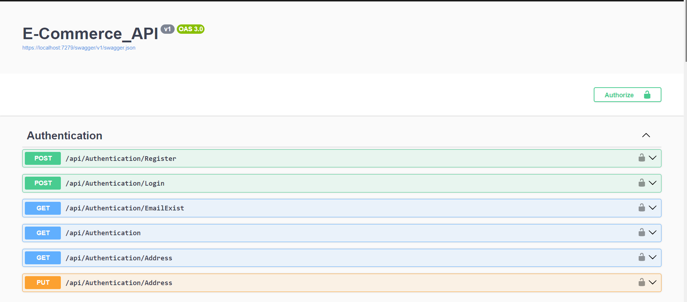
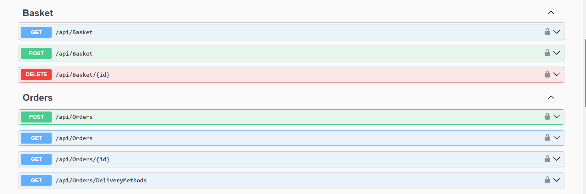

# 🛒 E-Commerce API (ASP.NET Core Web API)

A complete **E-Commerce backend solution** built using **ASP.NET Core Web API** following the **Onion Architecture** principles for clean, scalable, and maintainable code.

The project integrates advanced concepts like **Repository Pattern**, **Specification Pattern**, **Caching with Redis**, **Custom Attributes**, and **JWT Authentication**, while also supporting **Angular** as the frontend.

---

## 🚀 Key Features

- ✅ **Clean Architecture (Onion Architecture)** — separation of concerns and high scalability.  
- ✅ **Repository Pattern** with **Generic Repository** and **Unit of Work**.  
- ✅ **Service Layer + Service Manager** to organize and manage business logic and dependencies.  
- ✅ **Specification Design Pattern** for flexible filtering, pagination, and eager loading.  
- ✅ **Caching with Redis** to boost performance and minimize database load.  
- ✅ **Custom Caching Attribute** to dynamically check, store, and invalidate cache entries per request.  
- ✅ **Authentication & Authorization** with **JWT** and **ASP.NET Identity**.  
- ✅ **Payment Module** for secure checkout and transaction handling.  
- ✅ **Global Exception Handling Middleware** for consistent error responses.  
- ✅ **Extensible Configuration** through Extension Methods for `Program.cs`.

---

## 🧠 Technologies Used

| Layer | Technology |
|:------|:------------|
| **Backend Framework** | ASP.NET Core Web API |
| **Database** | SQL Server (EF Core ORM) |
| **Caching** | Redis |
| **Authentication** | JWT, ASP.NET Identity |
| **Architecture** | Onion Architecture |
| **Frontend (Companion)** | Angular |
| **Language** | C# |

---
## 🧩 Project Architecture Overview
```
ECommerceApp/
│
├── API/
│ ├── Controllers/ # Contains all API controllers
│ ├── Middleware/ # GlobalExceptionHandlingMiddleware for unified error handling
│ ├── Extensions/ # Extension methods to simplify Program.cs
│ ├── Factories/ # Handles custom validation error responses
│ ├── Filters/ # Custom ActionFilters (e.g., caching, validation)
│ ├── wwwroot/
│ │ └── assets/ # Project screenshots and static resources
│ └── Program.cs # Application entry point
│
├── Infrastructure/
│ ├── Persistence/
│ │ ├── Data/
│ │ │ ├── DbContext.cs # EF Core DbContext
│ │ │ ├── Migrations/ # Database migration files
│ │ │ ├── DataSeed.cs # Seeds initial data
│ │ │ └── DataSeedFiles/ # JSON data for seeding
│ │ ├── Identity/ # Identity configuration and DbContext
│ │ └── Repositories/ # Repository implementations
│ │
│ ├── Presentation/
│ │ ├── Controllers/ # API endpoint grouping
│ │ └── Attributes/ # Custom attributes (e.g., caching)
│
├── Core/
│ ├── Domain/
│ │ ├── Entities/ # Core business entities
│ │ ├── Contracts/ # Repository interfaces
│ │ └── Exceptions/ # Custom exception types
│ │
│ ├── Service/
│ │ ├── Implementations/ # Implements service abstractions
│ │ ├── MappingProfiles/ # AutoMapper profiles
│ │ └── Specifications/ # Specification logic
│ │
│ └── Service.Abstractions/
│ └── Interfaces/ # Business logic contracts
│
└── Shared/
├── DTOs/ # Data Transfer Objects
└── Common/ # Common helpers and constants
```

## 📸 Screenshots

### 🔹 API Endpoints & Features
| Authentication | Basket & Orders | Products & Payments |
|----------------|----------------|---------------------|
|  |  |  |

### 🔹 Redis Caching in Action
| Caching Example |
|-----------------|
|  |


## ⚙️ Setup & Run Locally

### 1️⃣ Clone the Repository
```bash
git clone https://github.com/Eslamrabei/E-Commerce.git
cd ECommerceApp

